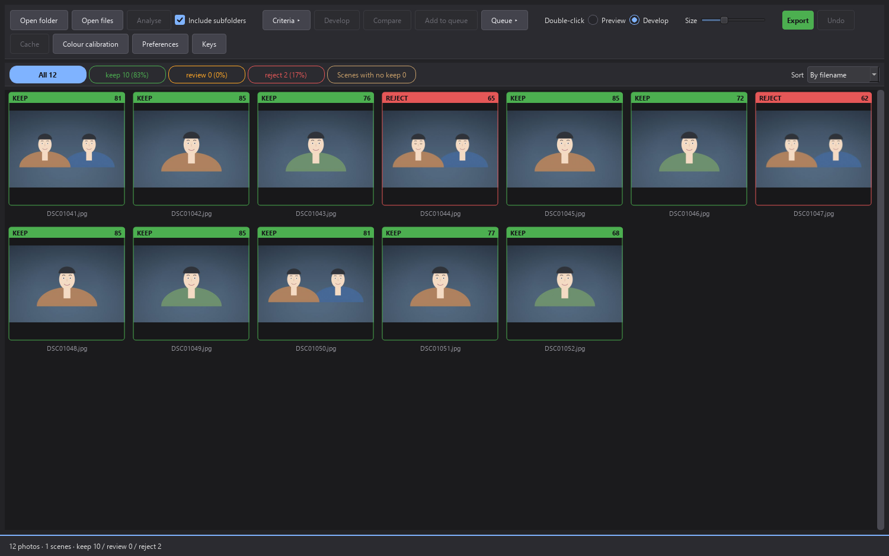

# RAW_selector

A desktop tool for **culling RAW photos by focus** and developing the keepers.
Built for batches of ~4,000 frames, running the same code on Windows and macOS.

### 📖 [Read the manual — docs/HOWTO.md](docs/HOWTO.md)

Every screen, button and shortcut, in workflow order, with screenshots.



It reads **anything LibRaw 0.22 opens** (ARW / CR3 / CR2 / NEF / RAF / ORF /
RW2 / DNG, ~20 formats) and judges and develops **JPEG and HEIF** directly, for
people who don't shoot RAW. Development and measurement were done on Sony,
Canon and Nikon bodies — Sony A6700, Canon R3/R5/R6/1DX Mark II/5D Mark III,
Nikon Z9/Z50 II — including the camera AF metadata each maker writes.

Select, develop (tone/colour/masks/watermark), and export all work from one
window. See [CHANGELOG.md](CHANGELOG.md) for what changed per release and what to
do when upgrading, and **[SUPPORTED.md](SUPPORTED.md)** for the full list of
decodable formats, colour-calibrated cameras, and lens-correction profiles.

## Why it's fast

Full-demosaicing 4,000 frames with rawpy takes 1–2 seconds each — over 1.5
hours. Instead it pulls the **full-size embedded JPEG preview** that the camera
already wrote (6192×4128 on an A6700, 8256×5504 on a Z9). That resolution is
plenty for a focus decision, and it finishes in ~30ms per frame.

Since 0.15.13 not even that preview is decoded in full colour. libjpeg hands
over a **grey plane at full resolution** (the sharpness measurements and the
eye landmarks) and a **half-size colour plane** from a DCT-scaled decode (face
detection, the scene fingerprint, the thumbnail), which is everything the
analysis reads. Measured at 12 workers: +31% on 50MP A1 frames, +23% on the
A6700; a 1,695-frame A1 batch analyses at 77 ms a frame wall-clock.

Measured (32 cores, 31 workers):

| Frames | Time | |
|---|---|---|
| 2,845 | 87s | cold (full analysis) |
| 2,845 | 0.3s | warm (cache hit) |
| 4,000 (scaled) | ~2 min | |

## Install

```bash
pip install -e ".[gui,dev]"
```

Needs `rawpy`, `opencv-python`, `PySide6`, `exifread`, `PyYAML`, `piexif`,
`pillow`, `pillow-heif` (the only decoder for `.HIF`/`.HEIC`) and `lensfunpy`
(lens profiles — a base dependency since 0.15.13, so a source install gets the
optical corrections too). Four ONNX models ship in the repo
(`arw_selector/core/models/`):

| Model | Size | Used for |
|---|---|---|
| `face_detection_yunet_2023mar.onnx` | 227KB | Face boxes + 5 points (analysis) |
| `face_mesh_192x192.onnx` | 2.3MB | 468-point mesh — face/eye masks, eye state, face presence, turn |
| `face_recognition_sface_2021dec.onnx` | 38.7MB | Face identity embeddings — the batch's subject (bystanders, mascots) |
| `u2netp.onnx` | 4.6MB | Subject segmentation (masks) |

All **fail soft**: if a model is missing the app still runs, it just loses face
detection or the mask/eye-closed features. That failure is silent, so if the
face features seem to be missing, check the startup log.

## Usage

### GUI

```bash
raw-selector
```

Open folder → analyse → review the grid → export.

- Grades show as thumbnail border colour (green keep / amber review / red reject).
- The **grade filter buttons** at the top show each grade's count and share;
  click to see only that grade.
- **Criteria** opens the judging panel. Changing a value **re-grades instantly,
  without re-analysing** (re-analysis is minutes; re-grading is 0.3s, so you can
  feel out the settings with the sliders live).
- The **score card** under the grid breaks the score down line by line, and its
  right side is a fact sheet for the shot — capture time, body, lens, focal
  length (with the 35mm equivalent on crop bodies), exposure, AF area mode, and
  location when the file carries one.
- **1 / 2 / 3** set the selected frame's grade by hand; **0** returns it to auto.
- **Space** or double-click opens the loupe — check the ROI that was judged,
  develop, change grade, and move between frames all in there.
- **D** develops (selected frames into the loupe), **Q** adds to the queue.
- **Esc** cancels analysis or export.

### CLI

```bash
raw-select D:/shoot                      # analyse, summary only
raw-select D:/shoot --report out.csv     # per-frame detail (.csv or .json)
raw-select D:/shoot --export             # copy into _keep/_review/_reject
raw-select D:/shoot --export --move      # move instead of copy
raw-select D:/shoot --export --grades keep,review
raw-select D:/shoot --export --dry-run   # show what goes where
raw-select D:/shoot --undo               # undo the last export
raw-select --dump-config > config.yaml   # config template
```

Other flags: `--config`, `--no-cache`, `--workers`, `--keep-per-group`,
`--target-keep PCT`, `--keep-above SCORE`, `--no-face-priority` (grade a batch
with few or no faces on score alone), `--recursive` / `--no-recursive`,
`-q/--quiet`, `-v/--verbose`.

The CLI has no develop/mask/watermark — those are GUI-only. The CLI does the
selection and file sorting.

## How it judges

### Focus

1. Extract the embedded preview and apply EXIF orientation.
2. Detect faces with YuNet on a downscaled copy (long edge 1024px).
3. If a face is found, back-project an **ROI around both eyes** to full
   resolution and crop it. Otherwise the sharpest grid tile is taken as the
   subject. The eye ROI is at least 40% of the face wide, so a profile — whose
   two eye points nearly coincide — measures the eye region and not a sliver
   of hair.
4. Measure Laplacian variance and Tenengrad on the ROI, **each divided by the
   patch variance**.

That last normalisation matters. Laplacian variance scales with the square of
contrast, so without it every low-light / low-contrast scene scores low
regardless of focus — the biggest source of misjudgement.

It has an opposite trap too: an empty dark background (variance 0.9) has a raw
gradient at noise level, but dividing by variance can push it **above** the real
subject. So a **signal gate** zeroes anything below std-dev 5 (sensor noise, no
basis for a focus call), and **tile selection uses the raw gradient** —
normalisation is for comparing *between* images, not tiles *within* one. A
**contrast floor** (std-dev 22) catches the subtler form of the same trap: a
nearly flat patch holding a few hard edges — a hazy face behind glass, a palm
over the eyes, a motion-blurred face — has little variance and a Laplacian
energy those edges alone supply, and used to out-score a crisp eye. Below the
floor the variance is taken as the floor, and the eye bonuses are credited in
the same proportion.

Measurements are taken at the calibration body's pixel scale: a preview longer
than 6192px (a 50MP body) is reduced to it first, so a bigger sensor does not
read the same optical sharpness lower.

With several faces in the frame, each face is measured for sharpness first, and
the main subject is picked by area × detection confidence among the ones that
are actually in focus — otherwise a bystander looming in the foreground beats
the person the shot was focused on. Portrait-style shoots that keep one person
near the middle can flip that with **Single-subject framing (portrait)** in the
Start analysis dialog (off by default): it picks by centrality first, measuring
95.4% against 77.9% on a 47,990-frame holdout of that genre — and losing to the
default on stage and group work, which is why it is an option and not a change.

`focus.ALGORITHM_VERSION` is part of the cache key, so changing how sharpness is
measured invalidates old scores automatically.

### Grouping

**Capture time is the main signal.** Measured on 2,845 frames, within-burst
intervals had a median of 0.16s while real scene changes were tens to hundreds of
seconds — time separates them cleanly where visual similarity does not.

### Eye-closed

Closed eyes are still in focus, so sharpness never catches them. The main
subject's 468-point mesh gives an **eye aspect ratio (EAR)**; below
`eyes_closed_below` (default 0.25) it subtracts `penalty_eyes_closed` (default
20). The **more open** of the two eyes is used (a profile's far eye always reads
closed). When the eyes can't be measured, nothing is subtracted — *unmeasured* is
not *closed*.

The threshold comes from hand-labelled frames rather than taste. On a 152-frame
set where the reason for each failure (one eye, blur, darkness, mis-aligned
landmarks) was separated out, 0.25 catches 67.1% of closed eyes at 10.3% false
penalties (79.4% accuracy) against 57.5% / 8.0% (76.2%) for a stricter 0.22. The
call stays deliberately asymmetric — missing a closed-eye frame only costs a
look in review, while penalising an open-eye frame quietly buries a good shot.

Two refinements from a 30fps burst shoot (55 labelled scenes):

- **A covered face withholds its eye signals.** A palm, a forearm or a fan sign
  over the eyes still detects as a face, the landmarks fit the hand, and the eye
  ROI measures a sharp palm — such frames used to top their bursts. The mesh
  model's own **presence score** (clean faces ≈ 1.0, covered faces median 0.24)
  and the landmark **turn** (a real profile puts the nose beyond the cheek,
  1.4~2.3; a covered frontal face reads 0.1~1.2) tell the two apart; presence
  below 0.3 with a frontal turn withholds the eye, eyes-open and focus-on-face
  bonuses. The face bonus stays.
- **Eyes closing, relative to the scene.** An EAR of 0.36 is open for one face
  and mid-blink for another; the burst itself shows what this face's open eyes
  look like. Below 70% of the scene's usual EAR (its median over five or more
  measured faces) and below 0.45, the frame gets `penalty_eyes_closing`
  (default 10) instead of the eyes-open bonus.

### Camera AF

Cameras record where they focused, and the app reads that back from Sony ARW,
Canon CR3, Nikon NEF, and **camera-produced Sony, Canon and Nikon JPEGs** (75% of
a real archive sample still carried it; the rest had been stripped by editing
software). Three things use it, none of which change the score on their own:

- **Use camera AF point when no face is found** (Start analysis dialog, off by
  default) judges the recorded AF area instead of guessing the sharpest tile.
- When the camera's AF points at a *different* person than the main subject, the
  reasons list says **main subject uncertain** — a flag to look again, not a
  score change. Following the AF instead measured worse (87% → 49% on 117
  labelled frames). On frames with one face or none it never fires at all.
- `P` in the loupe draws the recorded AF box next to the focus / face / eye
  overlays.

**Tracking AF is the exception — the frame is the subject.** With Sony real-time
tracking, Nikon 3D-tracking or Canon Face + Tracking, the face the frame sits in
becomes the main face; a frame beside or below a face (Sony records the tracked
*body*) belongs to that face, and with a single confident face in the frame the
box widens below the chin to a raised arm or the hip. A frame in no face at all
becomes the ROI itself and the detections are not the subject.

### Subject

Every frame picks its main face on its own, and in a burst that lets a mascot
head, an MC, a bystander with a camera or a poster face win a few frames —
which, graded against the burst's best, rejects the frames around them. A shoot
has a subject: the identity that is the main face far more often than any other.
Each detected face carries a **face identity embedding** (SFace); after the
analysis the batch is clustered (cosine 0.363), the dominant identity is the
subject, identities with at least 10% of its frames are co-subjects, and an
identity whose faces stand where the subject's face stood in neighbouring frames
(three times, box IoU 0.3) is the same person in another pose — SFace splits one
person into frontal and profile identities, and a 30fps face track runs straight
through the split. A frame whose main face is not the subject is **re-scored on
the subject's face** when that face is in the frame, and marked **not the
batch's subject** (face signals withheld) when it is not. Nothing happens
unless one identity clearly leads (10 frames and 30% of the embedded main
faces), and a main face picked by hand in the loupe is never touched.

### Grade

```
analysis failed                     -> reject
score >= keep threshold             -> keep
rank within group < keep_per_group  -> keep     (at least 1 per scene)
score < max(reject_below, batch p15)-> reject
>= 10 below the group best          -> reject    (a better near-duplicate)
otherwise                           -> review
```

The keep threshold is an absolute score by default (`keep_above`, 65). Setting
**`target_keep_ratio`** instead back-solves the threshold from the batch's own
score distribution, so the keep share stays stable when lighting or lens shifts
the scores — worth switching to if you carry thresholds between shoots. The most
expensive error is a **false reject**, so judging leans toward reject, and **the
group's best frame is never rejected** under any threshold combination. A keep
the score did not earn — the best frame of a scene that fell short of the
threshold — says so in its reasons ("kept as the best of its scene").

## Develop

Double-click (or Space / D) opens the loupe, where you develop, change grade, and
move between frames without breaking flow across hundreds of shots.

Supported adjustments: basic tone (temperature, exposure, highlights, shadows,
whites/blacks, texture, clarity, dehaze, vibrance, saturation), parametric +
drag-edit curves (RGB/R/G/B), detail (sharpening, multi-pass noise reduction
with a **face-priority** weighting, shadow-gated colour-noise removal, LED-wall
destripe), local masks (brush / radial / linear / face / eye / background /
subject, built from several pieces with add / subtract / intersect, each with
its own tone curve), HSL colour mixer, colour grading, effects (grain,
vignette), optics (lensfun auto + manual distortion / vignette correction /
defringe), crop & straighten, an info strip, watermark, and selective EXIF.

Colour noise is dealt with where it actually lives. The dark areas get a
wider, repeated pass while the bright ones keep theirs, because reaching the
same cleanliness across the whole frame costs saturation — measured on five
real high-ISO files, colour noise left in the shadows runs 46% → 15% at the
middle of the slider and 9% at the top, with bright-area colour unchanged
throughout.

A section that is not applying anything reads **(off)** in its header, and a
photo you have not edited opens with every section off; touching any control
switches its section back on.

For a lens the lensfun database does not know, **Measure lens profile from
this camera JPEG** fits one from the shot itself. The camera has already
corrected its embedded JPEG — corners brightened, distortion straightened —
and the neutral develop has not: the brightness ratio is the vignetting the
camera applied, the patch-by-patch displacement (phase correlation) is its
distortion. Distortion terms are fitted *through lensfunpy itself*, so what
is minimised is exactly what the engine will apply. It reproduces the camera
(vignetting ×1.14 at the corner on a Tamron 150-500 where lensfun's
flat-field profile says ×2.2; distortion to under 1px on a 50MP frame), refuses
frames that cannot be measured (dark corners, no texture, body correction
off), and gathers focal/aperture pairs of the same lens into one profile. Not
tied to one maker: the camera JPEG is first brought onto the neutral
develop's tone (learnt from the frame's middle, where no lens vignettes), so
picture styles cancel — verified on Sony A1, Canon R6 Mark II/III, Nikon Z 9
and Panasonic S1R / S5 II X (whose 1920px embedded preview is compared at
its own size, and whose wide end's 240px corner moves are read coarse to
fine).

**Match camera JPEG** fits exposure, tone curve and saturation to the RAW's own
embedded camera render (~16ms), so a develop starts where the JPEG you culled by
looked instead of at a flat neutral one — measured on 31 real files, luma MAE
19.8 → 6.5. The fit lands on the sliders as ordinary values, so everything stays
editable. Preferences can do it automatically on open, and it never touches a
frame that already has edits.

The preview and the export run the **same `engine.apply_settings`** — only the
resolution differs. **Full Render** re-develops at screen resolution when you
stop adjusting, to check sharpening/noise/masks at real quality (one at a time —
a 27MP demosaic takes ~2.8GB, and two at once crashes an 8GB machine).

For JPEG/HIF sources, camera profile / colour calibration / lens correction are
locked off (the camera already baked them in); white balance stays adjustable.

## Export

**Export** opens an options dialog — the same selection needs different files
depending on purpose (full-size print, 2048px social, low-res proof). You choose
grades, whether to copy the original RAW, folder splitting (by grade / by GPS
place), move vs copy, whether to render developed images, format (JPEG/PNG/WebP/
TIFF), quality, size, and filename pattern.

Every export writes a JSON log and is fully reversible with `--undo` (it only
deletes files this tool created). GPS location is **never written** into exported
files, and place-grouping is pure coordinate maths with no outside network call.

## Presets

Both judging and develop settings save as presets. On Windows they live in
`data/` next to the executable (the repo root when run from source), falling
back to `%APPDATA%\raw_selector\data\` only where that's read-only. The macOS
app always keeps them in `~/Library/Application Support/raw_selector/data/`:
writing inside the signed bundle breaks its seal, and replacing the app to
update would take everything saved in it along. Colour calibrations and
measured lens profiles sit in the same folder. Presets are plain YAML you can
edit or hand to someone else.

## Cache

Each shoot folder gets a `.raw_selector_cache/` with the analysis SQLite,
512px grid thumbnails, and undo logs. Entries and thumbnails are keyed by the
path *relative to the folder*, so the cache follows the folder: the same card
mounted under another name, given another drive letter, or read on the other
machine reuses it. When the folder cannot be written (locked card, NTFS on
macOS, read-only share) the cache lives in the user folder instead
(`cache_dir_for`), named by volume identity plus the path inside the volume
(`volume_identity`: Windows volume serial, macOS volume UUID via `diskutil`)
so a changed drive letter or mount name finds it again, with a `folder.txt`
marker naming the folder the keys are relative to (rewritten on every
visit); a cache already inside such a folder is opened read-only and still
hits. A cache write that fails mid-analysis (full card, pulled card)
drops the cache for that run and keeps the results. Two version keys (`cache.SCHEMA_VERSION`,
`focus.ALGORITHM_VERSION`) invalidate it automatically when the stored fields
or the measurement change, so upgrading re-analyses a folder once on first
open.

## Structure

```
arw_selector/
  core/            No UI. Does not import Qt.
    raw_io.py      Preview extraction, EXIF, orientation
    focus.py       Face/eye detection + sharpness + eye-closed (EAR)
    grouping.py    Scene grouping
    scoring.py     Score aggregation, grading
    cache.py       SQLite result cache
    pipeline.py    Parallel batch execution
    export.py      Folder sorting + undo
    develop/       Render pipeline, masks, optics, watermark
    models/        ONNX models (face detection · face mesh · face identity · segmentation)
  gui/             PySide6 (loupe, develop panel, criteria panel, grid)
  cli.py
```

CLI and GUI both go through `core.session.SelectionSession`; different results
for the same folder would be a bug. `core` never imports Qt — analysis runs in
`ProcessPoolExecutor` workers, and pulling Qt into every worker would cost
startup for nothing. User-facing text lives only in the GUI layer, with English
source strings and Korean shipped as a Qt translation.

## Cross-platform

Paths are all `pathlib.Path`; worker functions are module top-level with
picklable args (macOS uses spawn, not fork); extension comparisons are always
`.lower()`. Developed and verified on Windows 11 / Python 3.12; validated on
Apple Silicon macOS 14.

## Licence

The project's own code is MIT (see [LICENSE](LICENSE)). Bundled data and the
libraries used by packaged builds keep their own terms — see
[THIRD_PARTY.md](THIRD_PARTY.md). PySide6 and libheif in particular are LGPL-3.0.
