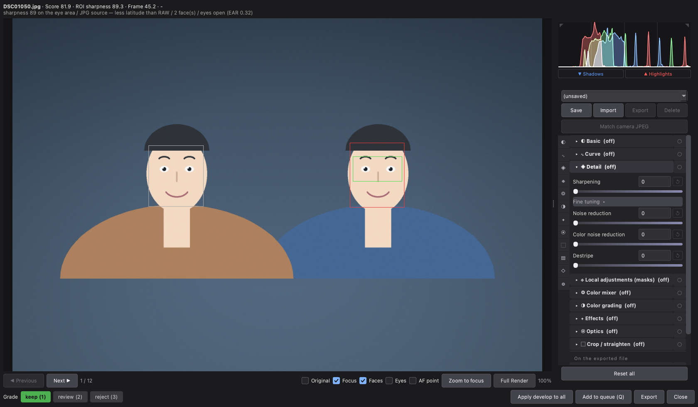
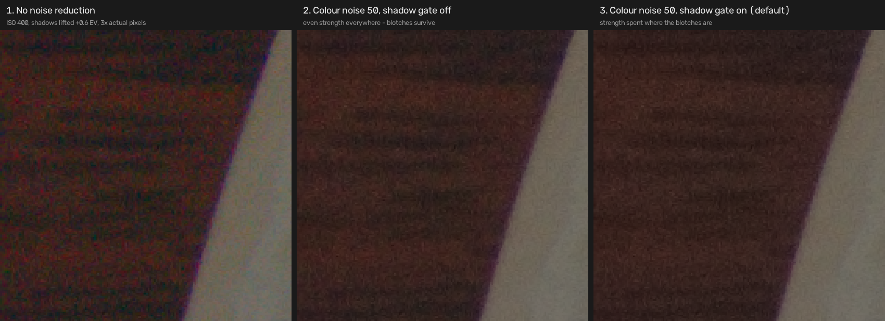
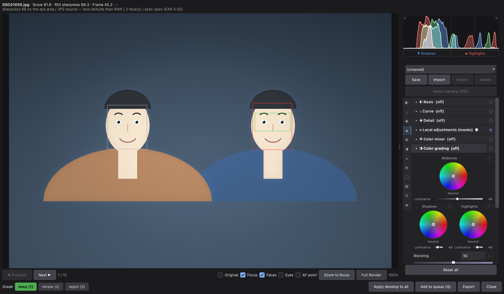

# RAW Selector — User Manual

A desktop tool for culling RAW photos by focus and developing the keepers.
This manual walks through the whole workflow in order: open a folder, analyse
it, review and cull in the grid, develop the keepers, and export.

## Contents

- [Getting started](#getting-started)
  - [Launching](#launching)
  - [Supported files](#supported-files)
  - [The main window at a glance](#the-main-window-at-a-glance)
  - [The status bar](#the-status-bar)
  - [Preferences](#preferences)
- [Opening photos](#opening-photos)
- [Analysing photos](#analysing-photos)
  - [The Start analysis dialog](#the-start-analysis-dialog)
  - [Progress and cancelling](#progress-and-cancelling)
  - [Camera colour calibration](#camera-colour-calibration)
  - [The analysis cache](#the-analysis-cache)
- [Reviewing and culling](#reviewing-and-culling)
  - [Filtering and sorting](#filtering-and-sorting)
  - [The thumbnail grid](#the-thumbnail-grid)
  - [Grading from the keyboard](#grading-from-the-keyboard)
  - [The score card](#the-score-card)
- [Developing](#developing)
  - [Opening the Develop window](#opening-the-develop-window)
  - [Navigating between photos](#navigating-between-photos)
  - [The viewer](#the-viewer)
  - [Histogram and clipping warnings](#histogram-and-clipping-warnings)
  - [Grading and actions](#grading-and-actions)
  - [The develop panel](#the-develop-panel)
    - [Match camera JPEG](#match-camera-jpeg)
    - [Basic](#basic)
    - [Curve](#curve)
    - [Detail](#detail)
    - [Local adjustments (masks)](#local-adjustments-masks)
    - [Color mixer](#color-mixer)
    - [Color grading](#color-grading)
    - [Effects](#effects)
    - [Optics](#optics)
    - [Crop and straighten](#crop-and-straighten)
    - [Capture info strip](#capture-info-strip)
    - [Watermark](#watermark)
    - [EXIF metadata](#exif-metadata)
  - [JPEG and HEIF sources](#jpeg-and-heif-sources)
- [The export queue and exporting](#the-export-queue-and-exporting)
  - [Adding photos to the queue](#adding-photos-to-the-queue)
  - [The queue panel](#the-queue-panel)
  - [Export options](#export-options)
  - [While an export runs](#while-an-export-runs)
  - [Undoing an export](#undoing-an-export)
- [Presets and criteria](#presets-and-criteria)
  - [Grading criteria — the Criteria panel](#grading-criteria--the-criteria-panel)
    - [Keep criteria](#keep-criteria)
    - [Reject criteria](#reject-criteria)
    - [Score weights](#score-weights)
    - [Scene splitting](#scene-splitting)
  - [Grading presets](#grading-presets)
  - [Develop presets](#develop-presets)
- [Command-line interface](#command-line-interface)
- [Appendix: keyboard shortcuts](#appendix-keyboard-shortcuts)

## Getting started

### Launching

Install the package, then run `raw-selector` for the GUI or `raw-select` for
the command-line tool. Both run the same analysis, so a folder graded in one
looks the same in the other.

### Supported files

The app opens every RAW format LibRaw decodes — ARW, CR3, CR2, NEF, RAF, ORF,
RW2, DNG and more — and also judges and develops JPEG and HEIF files directly.
See SUPPORTED.md in the repository for the full format and camera list.

### The main window at a glance

From top to bottom: the toolbar (open, analyse, develop, queue, export, cache,
preferences), the filter-and-sort row, the thumbnail grid, the score card for
the selected photo, and the status bar.

### The status bar

The bar along the bottom shows the current status message, a progress bar, and
a time-left estimate ("about … left") for whatever task is running. The
**Stop** button (or `Esc`) cancels the running task.

### Preferences

The **Preferences** toolbar button opens the "Preferences" dialog with two
tabs:

- **General** — the **Interface language** combo (**System default**, English,
  한국어) takes effect on the next start; a restart notice is shown. Under
  **Develop**, **Open develop with camera-matched start** (off by default)
  makes the Develop window open a not-yet-edited RAW fitted to its embedded
  camera JPEG instead of the flat neutral render — see
  [Match camera JPEG](#match-camera-jpeg). The **Check for updates** checkbox
  (off by default) enables update checks, and **Check now** runs one
  immediately with a status readout.
- **About** — application name and version, the licence texts, and a
  licensing note.

If the app ever hits an unhandled error, an "Error" dialog appears and points
to a written error report.

## Opening photos

- **Open folder** opens the "Choose a RAW folder" directory picker and loads
  everything in the folder. The last-used folder is remembered.
- **Open files** opens the "Choose RAW files" picker to load one file or a
  handful instead of a whole folder; analysis starts immediately after
  picking.
- The **Include subfolders** checkbox (on by default) scans the folder
  recursively.

## Analysing photos

### The Start analysis dialog

Click **Analyse** to open the "Start analysis" dialog before anything runs.

The dialog shows the photo count and what the cache can reuse ("Cache: {n}
photos can be reused", or "Cache: none — everything will be analysed fresh"),
plus a live estimate of how many photos will be analysed and how long it will
take.

- **Use cached results** — reuse previous results where possible; uncheck it
  to re-analyse everything from scratch.
- **Precision** group:
  - **Noise-robust sharpness** — a sharpness measurement that resists sensor
    noise.
  - **Single-subject framing (portrait)** — picks the main face by centrality
    first, for portrait-style shoots that keep one subject near the middle.
    Leave it off for group or stage photos, where the default pick does
    better.
  - **Use camera AF point when no face is found** — falls back to the
    camera's recorded AF point as the focus region when no face is detected
    (Sony, Canon CR3, Nikon).
  - **Develop small-preview RAW for analysis** — appears only when the batch
    holds RAW files whose embedded preview is too small to judge focus on
    (Panasonic RW2). Those files are demosaiced instead. The line under the
    estimate shows what each choice costs in time.

**Start analysis** begins the run; **Cancel** closes the dialog.

### Progress and cancelling

Progress appears in the status bar ("Analysing {done}/{total} (cached …,
failed …)") with a time estimate. **Stop** (`Esc`) cancels after the photo in
progress finishes; partial results are kept and labelled "Cancelled — results
so far". When analysis completes, a summary line reports the totals ("{total}
photos · {scenes} scenes · keep/review/reject counts").

### Camera colour calibration

When a photo comes from a camera model the app has no colour profile for, a
"New camera model" dialog offers to compute one (**Compute** / **Later**); a
"Computing color calibration" progress dialog with **Cancel** follows. You can
also run it manually at any time with the **Colour calibration** toolbar
button ("Compute color calibration on this PC"); the computed result overrides
the built-in library defaults.

### The analysis cache

The **Cache** toolbar button (its label shows the current size, or "No cache")
opens the "Clear cache" dialog. It lists the analysis entries, thumbnails,
total size, and the estimated time to rebuild; confirm with **Yes** to clear.
Undo records for past exports are kept.

The cache is keyed on the analysis options as well as the file, because a
result measured with different options is not the same result. Those options
are remembered between runs — while they were not, turning one on and
analysing a folder meant that the next time you opened the program the
options fell back to their defaults, the key no longer matched, and a full
cache counted as nothing: the folder asked to be analysed again from
scratch.

## Reviewing and culling

### Filtering and sorting

The filter buttons above the grid — **All**, **keep**, **review**,
**reject**, and **Scenes with no keep** — show live counts and narrow the
grid to one grade with a click. The **Sort** combo orders the grid **By
filename**, **Highest score first**, or **Lowest score first** (score sorting
ignores scene grouping).

### The thumbnail grid

Every thumbnail carries a grade band (KEEP / REVIEW / REJECT text and colour)
and a score badge; a ✋ marker flags shots you graded by hand. The tooltip
shows the score, grade, lens, ISO, shutter, aperture, and the grading reasons.

- The **Size** slider in the toolbar scales thumbnails from 90 to 360 px; the
  grid auto-fits its columns with no leftover gap.
- The **Double-click** mode radio buttons in the toolbar choose what a
  double-click opens: **Preview** (the embedded JPEG, instant) or **Develop**
  (demosaiced RAW with accurate colour; the default).
- Selection is extended multi-select; double-click or `Space` opens the
  selected photo in the loupe.

### Grading from the keyboard

With photos selected in the grid: `1` grades keep, `2` review, `3` reject, and
`0` clears the manual grade so the automatic grade applies again. `D` opens
the Develop window for the selection and `Q` adds the selection to the export
queue.

### The score card

Selecting a photo shows the score card along the bottom.

The left side is a point-by-point breakdown — rows such as Sharpness, Focus on
the face, Focus missed the face, No face, Face detected, Face size, Eyes
detected, Eyes open, Eyes closed, Eyes not measured, Blown highlights, Crushed
shadows, Lens cap / stray shutter, Clamped to range, and the **Total** — each
with an evidence note explaining the entry. The right side is a fact sheet for
the shot: Captured, Camera, Lens, Focal length (with the 35mm equivalent on
crop bodies), Exposure (aperture, shutter, ISO), AF area, and Location.

Below the breakdown, a line of reasons summarises the grade in words. One of
them is worth knowing: **"main subject uncertain — camera focused on someone
else"** appears when the camera's AF point sits on a different face than the
one used for grading. It never changes the score; it marks a shot worth a
second look, and only ever appears when two or more faces were found.

A row the file has no value for is left out entirely rather than shown as a
dash — files stripped of EXIF by re-saving tools are common, and a column of
dashes reads as breakage. AF area names appear only for camera modes verified
against real files, and stay in the camera's own English wording. Location is
shown to three decimal places and only on screen; exported files never carry
GPS.

To change *how* photos are graded, open the Criteria panel — see
[Grading criteria](#grading-criteria--the-criteria-panel).

## Developing

### Opening the Develop window

Double-click a thumbnail, press `Space`, or use the **Develop** toolbar button
(`D`) to open the loupe, titled "Develop — {name}". A multi-selection opens as
a browsable list, so the same edit can be applied to all of them. The window
is modeless — several can be open at once.

### Navigating between photos

**◀ Previous** (`←`) and **Next ▶** (`→`) move through the list, with a
position readout ("{n} / {total}").

### The viewer

Zoom with the mouse wheel, pan by dragging, and double-click to reset the
view; the current zoom percentage is shown. The header line shows the
filename, Score, ROI sharpness, Frame sharpness, lens/ISO/shutter/aperture,
and the grading reasons; if RAW demosaic fails, a warning notes the viewer is
"showing the embedded JPEG".

- **Original** (`B`) — before/after toggle.
- **Focus** (`F`) — a green box marking the region used for grading.
- **Faces** (`A`) — grey boxes around detected faces with the main subject in
  red; click a face to make it the main subject and re-grade the photo.
- **Eyes** (`E`) — eye contours.
- **AF point** (`P`) — an orange box where the camera focused (Sony, Canon
  CR3, Nikon).
- **Zoom to focus** (`Z`) — fills the screen with the grading region.

The overlays follow the crop, rotation and straighten, so they mark the same
spot of the photo whichever way the frame is set.
- **Full Render** — re-develops at full resolution whenever you stop
  adjusting; when zoomed in, only the visible region is rendered more finely.

The **Original** toggle compared — the untouched source on the left, the
current develop on the right:

### Histogram and clipping warnings

The histogram sits above the develop panel. Click its centre to cycle the
channel display (RGB / luminance / both); the corner triangles are clip
warnings. The **▼ Shadows** and **▲ Highlights** toggle buttons blink blue and
red overlays on clipped pixels, with a percentage readout ("crushed …% ·
blown …%", or "No clipped pixels to show").

### Grading and actions

The footer holds the grade buttons **keep (1)**, **review (2)**, **reject
(3)** (keys `1` `2` `3`), plus:

- **Apply develop to all** — applies this window's develop settings to every
  shot in the list (crop and straighten are excluded).
- **Add to queue (Q)** (`Q`) — queues this shot with its current develop.
- **Export** — exports this one shot right now (destination picker, then the
  "Export options" dialog).
- **Close**.

### The develop panel

The develop panel sits on the right (hidden in Preview mode; resizable via the
splitter). At the top is the develop-preset bar — see
[Develop presets](#develop-presets). A vertical strip of section icons jumps
to each section.

Every section header is collapsible and carries an eye button that switches
that section's edits on and off while keeping its values, so you can see the
photo with and without one part of your work. The header tells you where each
section stands:

- **(off)** — the section is not applying anything. A photo you have not
  edited opens with every section off, which is what makes the marks worth
  reading.
- **●** — the section holds values. Open a photo you edited before and
  exactly the sections that hold values come up switched on.
- **● (off)** — it has values, but you have switched them off for now.

Touching any control in a section that is off switches it back on, so a
slider you move always takes effect.

Sections above the **On the exported file** divider adjust the photograph.
The three below it — the capture-info strip, the watermark and the EXIF
metadata — put something onto the file that leaves, rather than changing the
picture.

Every slider row has its own reset button, and double-clicking a slider
resets it. **Reset all** at the bottom of the panel clears every edit.

#### Match camera JPEG

Under the preset bar, **Match camera JPEG** fits exposure, tone curve and
saturation to the render the camera itself made — the embedded JPEG inside the
RAW — so a develop starts near the picture you culled by instead of at the flat
neutral one. The fit lands on the sliders as ordinary values, so everything
stays editable and can be reset row by row. It leaves detail, masks and crop
alone.

The camera's local tone mapping is beyond a global curve, so treat the result
as a starting point rather than a copy. The button is disabled for JPEG and
HEIF sources, which have no separate camera render to match against.

Preferences → General → Develop → **Open develop with camera-matched start**
(off by default) applies the same fit automatically whenever the Develop window
opens a RAW shot. A photo that already has edits is never touched.

#### Basic

Global tone and colour: **Temperature** (absolute Kelvin, 2000–12000 K),
**Tint**, **Exposure** (EV), **Brightness**, **Contrast**, **Highlights**,
**Shadows**, **Whites**, **Blacks**, **Texture**, **Clarity**, **Dehaze**,
**Vibrance**, and **Saturation**.

On a RAW file **Temperature** re-develops from the sensor data once you stop
moving the slider, which is what white balance physically is. While you drag,
a fast approximation stands in, so the preview settles a moment after you let
go.

**Highlight recovery (RAW)** rebuilds detail in channels the sensor clipped.
It is off by default because it darkens the whole frame by 1–1.5 stops to
make room for what it recovers.

#### Curve

A point-curve editor with a **Clipping** toggle and channel buttons **RGB** /
**R** / **G** / **B**, plus ↺ **Reset this channel's curve**. Click to add a
point, drag to move it, right-click or double-click to delete it, and
double-click an empty area to reset. Below it are the parametric sliders
**Highlights**, **Lights**, **Darks**, and **Shadows**.

#### Detail

Three sliders are in the open — **Sharpening**, **Noise reduction**, and
**Color noise reduction** — plus **Destripe**, which takes out the horizontal
banding LED lighting leaves.

Everything that shapes *how* those three work sits under **Fine tuning**,
folded away: **Sharpen radius**, the **Noise method** combo (**Standard
(non-local means)**, **High quality (non-local means, slow)**, **Fast
(bilateral filter)**, **Legacy (reproduces old versions)**), **Passes** (1–4,
NL-means only), **Detail preservation**, **Color noise radius**, **Shadow
color noise**, and **Face priority** (weights noise reduction toward faces).
The defaults there are measured ones; open the fold when a particular photo
needs it, not every time.

**Shadow color noise** is on by default and does the work where colour
blotching is worst. Measured on the shadows of five high-ISO files, colour
noise left at the middle of the **Color noise reduction** slider drops from
46% to 15% with it on, and the top of the slider reaches 9%. Bright areas
keep their colour throughout — the top of the slider spends colour in the
dark instead, which is why the strength is gated to the shadows at all.

*The edge of a plate against a dark table, shadows lifted +0.6 EV and shown
at 3× actual pixels. Left: the red and green speckle colour noise leaves in
the shadows. Middle: the slider at 50 with the shadow gate off. Right: the
default. The lit side of the frame looks the same in all three — the gate
spends the strength on the dark side instead, where measured blotching falls
a further 33% (0.81 → 0.54). This is the one picture in the manual taken from
a real photograph; the rest are drawn, because a photograph of a real place
carries faces, number plates and signs into a public repository.*

Several gentle passes cost far less detail than one strong pass for the same
amount of noise removed, so **Passes** starts at **2**, and pushing **Noise
reduction** past 70 nudges it to 3. The slider visibly moves rather than
changing anything behind your back, so you can put it back; if you had
already chosen 3 or 4 it is left alone. A photo saved under an earlier
version keeps the pass count it was saved with and renders exactly as it did.

The cost is time, not detail. Time is proportional to the pass count: about
0.9 seconds per pass at 32MP, and on a 50MP frame the noise stage measured
6.3 seconds at one pass against 8.4 at two. How much of that you notice in an
export depends on the machine.

**"High quality (non-local means, slow)" is not the one to reach for first.**
The name describes a wider search window (a 7×7 patch over 21 pixels against
Standard's 5×5 over 11), not a better result. Its old headline figure was
measured with the two methods removing an *equal* amount of noise — but you
set a slider, not a removal target, and at the same slider value it runs
about 2.7× slower, removes a similar amount, and gives up *more* detail than
**Standard**: across four files at ISO 800–12800, edge retention of 50–99%
against Standard's 73–100%, with a blotchier residual. It earns its place on
a frame where you want the last of the fine grain gone and there is little
detail to lose; it is not a free upgrade.

#### Local adjustments (masks)

**＋ Add mask** opens a menu of mask types:

- Portrait: **Under-eye retouch**, **Smooth skin**, **Sharpen irises**,
  **Whiten teeth**, **Brighten face**
- Background: **Emphasize subject (darken background)**, **Blur background
  (bokeh)**
- Light & sky: **Bluer sky**, **Spotlight (darken surroundings)**, **Brighten
  area (radial)**, **Darken area (radial)**
- Subject: **Keep the main subject**, **Emphasize the subject (precise)** —
  a trained segmentation model, so the edge follows hair far more finely than
  the colour-spread background masks do. On a stage shot with several people
  the model tends to pick the one that stands out; the others that were
  detected are filled back in by the older method, so you do not get a photo
  where four of five people were left alone.
- Manual: **Brush (paint by hand)**

Masks stack in a list with per-mask enable checkboxes, a **Show region**
toggle (red overlay), and **Delete**. Brush masks add **Paint**, **Eraser**,
**Clear all**, and **Brush size** (%) controls. Face and eye masks have an
**Apply to** combo — **Main subject**, **All faces**, or **By number** with a
number spin — plus a face-count readout. Every mask has **Range** (%),
**Strength** (%), **Feather** (%), and **Invert region**, and its own
adjustment sliders: **Exposure**, **Contrast**, **Highlights**, **Shadows**,
**Temperature**, **Saturation**, **Texture**, **Clarity**, **Skin
smoothing**, and **Sharpening**.

**Building a region from several pieces.** A mask is not limited to one
shape. Under the mask you can add pieces that **Add** (both areas),
**Subtract** (take one out of the other — the face without the eyes), or
**Intersect** (only where both overlap — the top half of the background
only). Each piece carries its own feather, range and invert, and can be
unticked to take it out for a moment. The red **Show region** overlay draws
the finished region, so what you see is always what gets adjusted.

**Tone curve (advanced).** Below the mask sliders is a folded **Tone
curve ▸**. Open it and you get the same editor as the global curve —
luminance, R, G and B — applied to that mask's area alone. It is there for
gradation the sliders cannot reach: pressing down a sky, cooling a background
on its own. A mask that already carries a curve opens the fold for you, so a
picture never changes somewhere you cannot see. Radial and linear masks show drag handles on
the image — drag the centre to move, an edge point to resize, an outer point
to rotate.

Masks stick to the photo, not to the crop: changing the crop, rotating or
flipping later carries every mask along, and a mask that ends up outside the
crop simply stops applying. While a mask's handles are up, or the brush or
the red region overlay is active, the view temporarily shows the whole
uncropped photo — the same way crop editing does — and returns to the
cropped view when you put the handles down.

#### Color mixer

Per-colour adjustment over eight bands. Pick the channel (**Hue**,
**Saturation**, or **Luminance**), then move the band sliders: **Red**,
**Orange**, **Yellow**, **Green**, **Aqua**, **Blue**, **Purple**,
**Magenta**.

#### Color grading

Three colour wheels — **Midtones**, **Shadows**, **Highlights** — each with a
**Luminance** slider and a zone reset; drag a wheel to set hue and
saturation, double-click it to reset. **Blending** and **Balance** control how
the zones mix.

#### Effects

Film-style finishing: **Grain**, **Grain size**, **Correct vignetting**, and
**Vignette midpoint**.

#### Optics

Lens corrections. The **Auto lens profile** checkbox applies the matched lens
profile, with **Distortion** / **Vignetting** / **Chromatic aberration**
sub-checks and a ✓/✗ lens-match readout. If the lens is misidentified, pick
one in the **Lens override** editable combo. **Lens profile folder** opens the
folder where you can drop your own lensfun XML profiles, and **Reload lens
DB** re-reads it, with a coverage readout. **Manage camera color calibration**
opens a dialog to view or delete saved calibrations. Under **Manual
correction** are **Distortion**, **Vignetting**, **Remove purple fringing**,
and **Remove green fringing**. Manual **Vignetting** is scaled in stops —
50 is exactly half of 100, and 100 lifts the corners by 2.2 stops, enough to
stand in for a lens the profile database does not cover; the **Sample colour** eyedroppers **💧 Purple**
and **💧 Green** let you click the fringing in the preview to set the
reference hue, which is shown next to them.

#### Crop and straighten

**✂ Crop directly on the image** toggles on-image cropping: drag a corner to
resize, drag inside to move, double-click to reset to the whole frame. The
**Ratio** combo offers **Free**, **Original ratio**, 1:1, 4:3, 3:2, and 16:9.
**Straighten** rotates ±45°, with **Left** / **Right** / **Top** / **Bottom**
crop sliders for precise edges. **⟲ 90°** and **⟳ 90°** rotate in steps, and
**Flip horizontal** / **Flip vertical** mirror the frame; the current
rotation is shown.

#### Capture info strip

**Add an info strip below the image** renders a caption bar on export. Choose
the **Background** (**Black background / white text** or **White background /
black text**), tick the fields to include — **Filename**, **Camera**,
**Lens**, **Focal length**, **Aperture**, **Shutter**, **ISO**, **Date
taken** — set the **Strip height** (%), and optionally add free text for the
right side (artist name, etc.).

#### Watermark

The watermark has its own preset bar at the top of the section — the same
save / import / export / delete controls as develop presets, kept separate
so one watermark can be reused across any number of looks (develop presets
do not store the watermark).

**Add watermark** overlays text or a PNG image on export. Enter the text and
pick a **Font**, or **Browse** to a PNG file. **Position** places it on a
nine-cell grid (**↖ Top-left** through **· Center** to **↘ Bottom-right**),
refined by **Opacity**, **Size**, **Margin**, **Horizontal offset**,
**Vertical offset**, and **Rotation**. **Color** opens the "Watermark colour"
picker, and **Shadow (legibility on light backgrounds)** adds a drop shadow.

#### EXIF metadata

**Include EXIF on export** (off by default) writes selected metadata into
exported images. Field checkboxes: **Camera (make/model)**, **Lens**,
**Exposure (shutter/aperture/ISO)**, **Focal length**, **Date taken**,
**Artist**, **Copyright**, **Software**, with **Artist name** and **Copyright
notice** text fields. GPS location data is never written.

### JPEG and HEIF sources

For non-RAW sources, sensor-based items (auto lens profile, camera colour
calibration) are locked with an explanatory note; relative white balance still
works.

## The export queue and exporting

### Adding photos to the queue

The queue collects shots — each with its current develop settings — across
folders, so you can export them in one batch. Add from the grid with the
**Add to queue** toolbar button (`Q` on the selection) or from the loupe with
**Add to queue (Q)**.

### The queue panel

The **Queue ▸** toggle button (the count is shown on its label) opens the
queue panel:

- The table shows **File**, **Develop preset**, **Crop**, and **Grade** for
  each row; missing source files are flagged in red. Double-click a row to
  edit that shot in the develop window.
- Each row has a preset combo — **(no edit)**, **(per-photo edit)**, or a
  saved develop preset. A preset's crop and masks never overwrite the row's
  own.
- **Selected rows:** a bulk preset combo plus **Apply** sets many rows at
  once, and a watermark combo plus **Stamp** puts one watermark on every
  selected row. Watermarks are stored separately from the colour work (so the
  same logo can ride on several looks), which used to mean there was no way
  to apply one in bulk — a hundred photos meant opening the develop window a
  hundred times. Stamping leaves each row's develop settings, crop and masks
  alone; picking **(no edit)** takes the watermark back off.
- **Remove selected** deletes rows; **Clear** empties the queue after a
  confirmation.
- **Save** / **Load** store the queue as a JSON file; loading merges into the
  existing queue.
- **Export queue** starts the export (destination picker, then the "Export
  options" dialog). The queue is cleared after a fully successful export.

### Export options

There are three ways in: the **Export** toolbar button (the whole analysed
session), **Export** in the loupe (a single shot), and **Export queue**. Each
asks for a destination folder, then opens the "Export options" dialog.

- **Files** group — **Grades to export** (keep / review / reject checkboxes;
  none selected means all), **Also export the original RAW**, **Also export
  bundled JPG/HIF/XMP**, **Split into folders by grade (_keep / _review /
  _reject)**, **Split into folders by location (GPS)**, and **Move instead of
  copy** (undoable).
- **Developed images** group — **Render developed images** turns on
  rendering; then choose the **Format** (**JPEG (recommended)**, **PNG
  (lossless, large)**, **WebP**, **TIFF (lossless, for print/re-edit)**),
  **Quality** (%), **Bit depth** (**8-bit** / **16-bit** — PNG and TIFF
  only; the other formats lock it to 8), **Colour space** (**sRGB** /
  **Adobe RGB**), and **Size** (**Original size**, **By long edge**, or
  **Percentage**), with long-edge presets (**Custom**, 1080, 1920 FHD, 2048
  web, 2560 QHD, 3000, 3840 4K/UHD, 4000, 6000 for print) or direct px / %
  entry.

  The colour space converts the pixels and embeds the matching profile, so
  the file carries its own definition. **sRGB** is the safe default for
  screens and sharing. **Adobe RGB** covers more green and cyan for print
  work, but looks desaturated in viewers that ignore colour profiles.
  Pair it with **16-bit** where the format allows: an 8-bit file in the
  wider space loses shadow steps.
- **Filename** group — a **Pattern** field with click-to-insert token buttons
  **{name}**, **{index}**, **{grade}**, **{date}**, **{time}**, **{score}**.
  **{date}** and **{time}** are the time the shutter fired. If the analysis
  did not record one — a photo that came from an older cache, or one that was
  never analysed in this session — the file's EXIF is read directly rather
  than quietly falling back to today's date; failing that, the file's
  modification time (which is the capture time for a card straight off the
  camera), and only then the clock.

A live one-line summary shows what will be exported, with an example
filename. **Export** starts; **Cancel** backs out.

### While an export runs

Exports run in the background with progress and a time estimate in the status
bar; **Stop** (`Esc`) cancels. Grading and develop edits are locked while an
export runs, and only one export runs at a time. A completion dialog ("Export
finished" or "Export cancelled") reports the copied, developed, and failed
counts.

### Undoing an export

The **Undo** toolbar button reverts the most recent export in the current
folder — an "Undo" confirmation first, then "Undo finished". It only removes
files the export created.

## Presets and criteria

### Grading criteria — the Criteria panel

The **Criteria ▸** toggle button opens the grading criteria panel. Changing
any value re-grades the whole batch instantly — no re-analysis — so you can
feel out the thresholds live.

At the top is the preset bar: a preset combo ("(unsaved)" plus your saved
presets), **Save** ("Save preset" name dialog), **Import**, **Export**, and
**Delete**. **Save to file** / **Load from file** store the grading criteria
as a YAML file ("Save grading criteria" / "Load grading criteria"). **Restore
defaults** returns everything to stock.

#### Keep criteria

- **Aim for a target ratio** with **Target keep ratio** (%) — keeps roughly
  that share of the batch, with a live score-distribution readout (min, mean,
  max, and the resulting cut score).
- **Absolute keep score** (pts) — a fixed score threshold instead.
- **Keeps per scene** — guarantee this many keeps in every scene (0 means "no
  guarantee").
- **Keep quality floor** (pts) — the minimum score a guaranteed keep must
  reach, with a warning readout for scenes left with no keep.

#### Reject criteria

- **Gap to the scene's best** (pts) — reject shots this far behind the best
  of their scene.
- **Absolute floor** (pts) — reject below this score outright.
- **Batch bottom percentile** (%) — reject the bottom slice of the batch.

A scene's best shot is never rejected, whatever the thresholds.

#### Score weights

A live formula readout shows how the score is built. Below it:

- **Face-priority mode** with its sub-values — **Focus missed the face**,
  **Focus on the face**, **No face**, **Eyes open**, **Eyes closed**, and
  **Eyes-closed threshold (EAR)**.
- ROI trust spins — **Eye**, **Face**, **Estimated subject**, **Whole
  frame** — how much each focus-region type is trusted.
- Bonuses — **Face detected**, **Eyes detected**, **Face size**, and **Face
  size for full bonus** (%).
- Penalties — **Blown highlights**, **Crushed shadows**, **Lens cap / stray
  shutter**, plus **Highlight tolerance** and **Shadow tolerance**.

#### Scene splitting

Controls how the batch is divided into scenes: **Scene gap** (s), **Scene
change distance**, **Distance without a time**, and **Largest scene**.

### Grading presets

Grading criteria save as named presets via the Criteria panel's preset bar,
and as standalone YAML files with **Save to file** / **Load from file** — the
files are plain text you can edit or hand to someone else.

### Develop presets

The develop panel's preset bar works the same way: a develop-preset combo
with **Save**, **Import**, **Export**, and **Delete**. Saved develop presets
also appear in the queue panel's per-row combos, so queued shots can take a
look with one click.

A develop preset stores the look only. Crop, straighten, rotation, masks and
the watermark are left out on save, and loading a preset keeps the current
shot's values for all of them — swapping looks never un-crops a photo,
moves a local adjustment, or removes a watermark. Watermarks have their own
presets in the Watermark section.

## Command-line interface

The `raw-select` command runs the same analysis core as the GUI, for
scripted or headless culling. Usage: `raw-select FOLDER [options]`. Given
just a folder, it analyses and prints a per-grade summary with counts, ratios,
and failures. The CLI covers selection and file sorting; developing is
GUI-only.

- `--config PATH` — load a settings YAML.
- `--report PATH` — write a per-photo report as `.csv` or `.json` (grade,
  score, group, sharpness, focus source, face count, capture time, lens, ISO,
  shutter, reasons, errors).
- `--export [DIR]` — export into grade folders (`_keep` / `_review` /
  `_reject`); with DIR omitted, they are created inside the source folder.
- `--grades LIST` — export only these grades (comma-separated:
  keep,review,reject).
- `--move` — move instead of copy.
- `--dry-run` — show what would go where without doing it.
- `--undo` — revert the most recent export in the folder.
- `--no-cache` — ignore the cache and re-analyse everything.
- `--workers N` — parallel worker count. The default is chosen from the
  CPU count and the memory currently free.
- `--keep-per-group N` — keeps per scene.
- `--target-keep PCT` — target keep ratio in percent; the threshold is
  derived from the batch's score distribution.
- `--keep-above SCORE` — absolute keep score (overrides the target ratio).
- `--recursive` / `--no-recursive` — include or exclude subfolders.
- `-q` / `--quiet` — hide the progress bar.
- `-v` / `--verbose` — detailed logging.
- `--dump-config` — print the current configuration as YAML.

## Appendix: keyboard shortcuts

### Grid (main window)

| Key | Action |
|---|---|
| `1` / `2` / `3` | Grade the selection keep / review / reject |
| `0` | Clear the manual grade (back to automatic) |
| `Space` | Open the selected photo in the loupe |
| `D` | Open the Develop window for the selection |
| `Q` | Add the selection to the export queue |
| `Esc` | Stop the running task (analysis or export) |
| Double-click | Open the photo (**Preview** or **Develop**, per the toolbar mode) |

### Loupe (Develop window)

| Key | Action |
|---|---|
| `←` / `→` | Previous / next photo |
| `1` / `2` / `3` | Grade keep / review / reject |
| `B` | **Original** — before/after toggle |
| `F` | **Focus** overlay (grading region) |
| `A` | **Faces** overlay |
| `E` | **Eyes** overlay |
| `P` | **AF point** overlay |
| `Z` | **Zoom to focus** |
| `Q` | **Add to queue** |
| Mouse wheel | Zoom |
| Drag | Pan |
| Double-click (image) | Reset the view |
